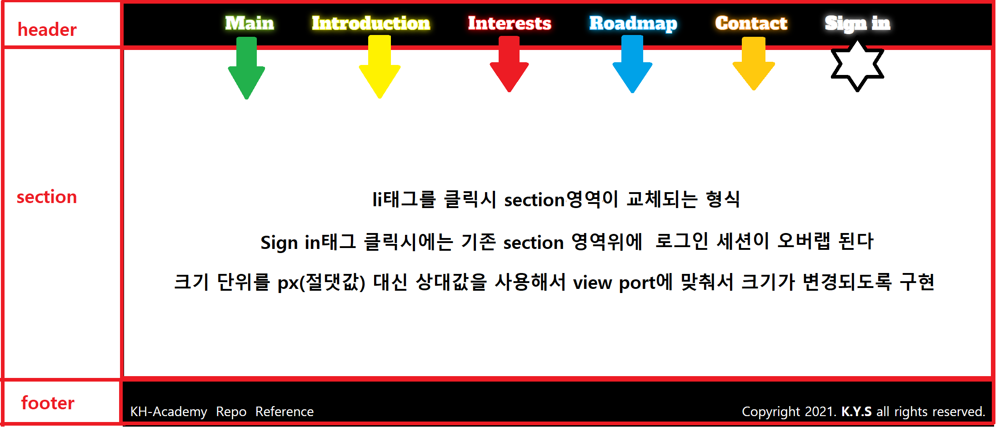

# kimdia200.github.io

## 1. 개요

- KH정보 교육원의 웹 개발자 양성과정중 개인 프로젝트로 HTML과 CSS, JS, JQuery의 개념정립을 목표로 프로젝트를 진행함

---

## 2. 제작기간

### 210307~210318

- 약 2주 조금 안되는 기간동안 작업을 했으며

- 매일 7시간의 HTML~JQUERY까지 강의를 들으며 프로젝트를 동시에 진행함.

---

## 3. 개발 목표 및 주안점

### 개발목표

- 배운 기술들을 최대한 활용해서 작업하고 전반적인 사용 기술의 이해를 목표로 진행

### 주안점

- One Page WebSite를 목표로 하였으며 모든 설정값을 절대값이 아닌 상대값을 적용해서 크기에 맞게 비율적으로 적용되도록 반응형 설계를 하였다.

---

## 4. 레이아웃

## 

## 5. 각 세션별 이미지

## 1)Main 세션

## 2)Introduction 세션

## 3)Interests 세션

## 4)Roadmap 세션

## 5)Contact 세션

## 6)로그인 세션

---

## 6. 사용 언어 및 도구

- OS : Windows10

- 언어 : HTML, CSS, JAVA_SCRIPT, JQUERY

- IDE : VSCODE

---

## 7. 아쉬운점

- 강의수강과 프로젝트 진행을 동시에 진행해서 혼자 공부 하면서 프로젝트를 진행 했던 부분이 많았는데
- 기존에 어렵게 구현했던 것들을 나중에 더 간단하게 구현하는 방법을 알게되어 아쉬웠다.
- 또한 그런 기능을 미리 알고 있었다면 좀 더 많은 기능을 구현햇을텐데 라는 아쉬움이 많다.
